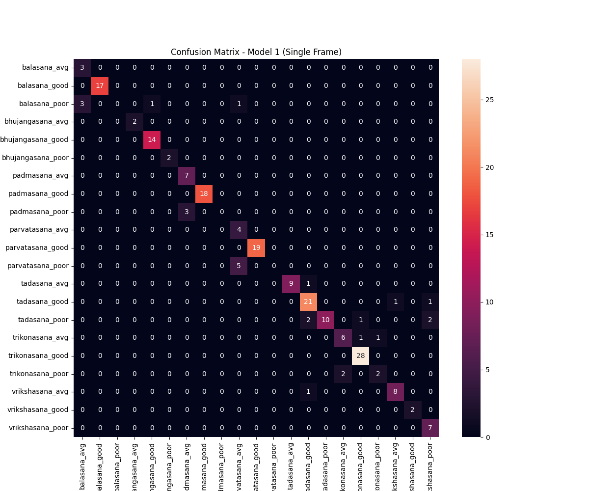
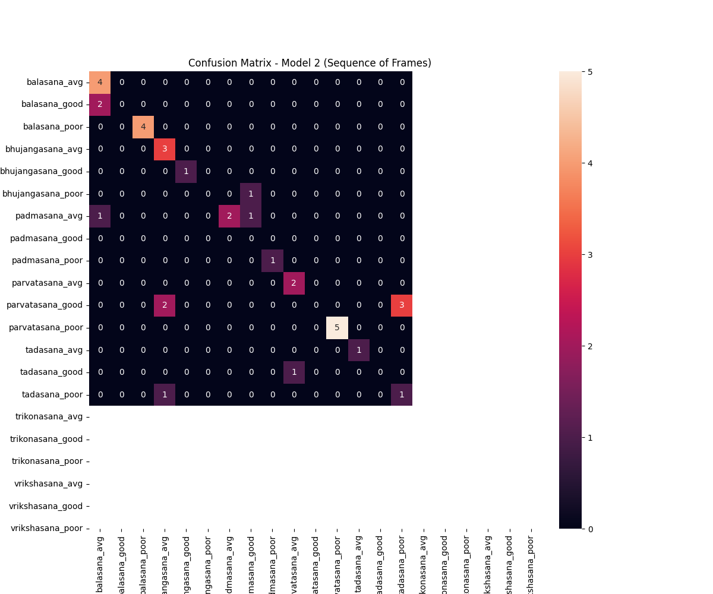

# Yoga Posture Analysis and Improvement System

This project implements a real-time yoga posture analysis application that evaluates student performances and suggests improvements. The system uses computer vision and machine learning to distinguish between different asanas and assess the quality of the posture (Good, Average, Poor).

---

## a. Dataset Strategy
The dataset strategy focused on capturing a wide range of yoga performances to ensure model robustness. We recorded short videos of students performing various Yogasanas. The strategy involved:
- **Diverse Conditions**: Ensuring variations in backgrounds, ambient lighting, and student clothing.
- **Performance Levels**: Capturing three distinct levels of performance for each asana:
  - **Good**: Correct alignment and stable posture.
  - **Avg (Average)**: Minor alignment issues or slight instability.
  - **Poor**: Significant alignment errors or inability to hold the pose.

## b. Dataset Collection & Compilation
Videos were collected and organized into a structured directory format:
- Each asana has its own folder (e.g., `balasana`, `bhujangasana`).
- Within each asana folder, videos are categorized into `good`, `avg`, and `poor` subfolders.
- The dataset was compiled by merging these individual video clips into a sequence-ready format, where each video is labeled with both the asana name and the performance quality.

## c. Dataset Labelling and Preprocessing
- **Pose Extraction**: We used the **MediaPipe Tasks API (Pose Landmarker)** to extract 33 high-fidelity pose landmarks (x, y, z, and visibility) from each frame of the videos.
- **Normalization**: Landmarks were extracted in normalized coordinates relative to the image dimensions.
- **Data Augmentation**: By processing every 2nd or 3rd frame and using sliding windows for sequences, we increased the variety of samples available for training.
- **Labelling**: Each frame/sequence was labeled as `asana_quality` (e.g., `vrikshasana_good`).

## d. Model Architecture

### **Model 1: Single Frame Analysis**
- **Type**: Dense Neural Network (MLP)
- **Input**: 132 features (33 landmarks * 4 values: x, y, z, visibility)
- **Layers**:
  - Dense Layer (128 units, ReLU)
  - Dropout (20%)
  - Dense Layer (64 units, ReLU)
  - Dropout (20%)
  - Output Layer (Softmax for multi-class classification)
- **Goal**: Fast, per-frame classification of posture.

### **Model 2: Sequence of Frames Analysis**
- **Type**: Recurrent Neural Network (LSTM)
- **Input**: Sequence of 10 frames, each with 132 landmark features.
- **Layers**:
  - LSTM (128 units, return sequences)
  - Dropout (20%)
  - LSTM (64 units)
  - Dropout (20%)
  - Dense Layer (64 units, ReLU)
  - Output Layer (Softmax)
- **Goal**: Capturing temporal dynamics and stability over time.

## e. Model Training
Both models were trained using the **Adam optimizer** and **Sparse Categorical Cross-Entropy loss**.
- **Data Split**: 80% Training, 20% Testing.
- **Epochs**: 20
- **Batch Size**: 32
- **Validation**: 20% of the training set was used for internal validation to monitor overfitting.

## f. Model Optimization & Comparison

| Metric | Model 1 (Single Frame) | Model 2 (Sequence/LSTM) |
| :--- | :--- | :--- |
| **Accuracy** | 0.8732 | 0.6667 |
| **Loss** | 0.4991 | 1.4252 |
| **Recall (Weighted Avg)** | 0.87 | 0.67 |

### **Confusion Matrices**
#### Model 1 (Single Frame)

#### Model 2 (Sequence)

## g. Bonus Evaluation: Model Comparison & Conclusion

### **Model 1 (Single Frame) Performance**
- **Strengths**: Extremely fast and responsive. Highly accurate at identifying the asana itself when the pose is clearly visible in a single shot.
- **Weaknesses**: Lacks context. It cannot distinguish between a user momentarily reaching a pose vs. holding it steadily. It may flicker if the landmark detection is noisy for a single frame.

### **Model 2 (Sequence/LSTM) Performance**
- **Strengths**: Captures the "flow" and stability. It is much better at identifying the *quality* of the hold, as it sees the movement (or lack thereof) over 10 frames. It acts as a temporal filter, reducing noise from individual frame detections.
- **Weaknesses**: Higher latency (needs 10 frames to make a full prediction). Currently shows lower accuracy due to the increased complexity of the temporal patterns compared to the amount of available sequence data.

### **Conclusion**
For a real-time yoga assistant:
- **Model 1** is best for **instant pose recognition** and basic alignment checks.
- **Model 2** is superior for **evaluating performance quality** and stability.
- **Hybrid Approach**: The best results are achieved by using Model 1 for immediate feedback and Model 2 for a "Stability Score" over longer durations.

---

### **Real-time Output Example**
The system provides live feedback on the video feed:
- **Green Text**: Single frame prediction and confidence.
- **Blue Text**: Sequential analysis result.
- **Red Text**: Feedback/Suggestions (e.g., "Focus on alignment and steady breathing").

 *(Note: Run the script to see live visualization)*
